# 📅 MasterBooking

[](https://www.python.org/)
[](https://fastapi.tiangolo.com/)
[](https://www.postgresql.org/)
[](https://www.sqlalchemy.org/)
[](https://alembic.sqlalchemy.org/)
[](https://redis.io/)
[](https://docs.celeryq.dev/)
[](https://react.dev/)
[](https://vite.dev/)
[](https://www.docker.com/)

> Сервис онлайн-записи к мастерам, разработанный на FastAPI, PostgreSQL и React.

## 📖 О проекте

**MasterBooking** — веб-приложение для поиска мастеров и записи на их услуги.

Платформа позволяет клиентам находить мастеров, просматривать их услуги и расписание, создавать и отменять записи, оставлять отзывы и управлять своим профилем.

Мастера получают отдельный рабочий интерфейс, в котором могут создавать услуги, настраивать рабочее расписание, просматривать клиентские записи и управлять их статусами.

Для управления справочными данными предусмотрена административная часть с категориями, тегами, городами и районами.

Проект построен как REST API на **FastAPI** с асинхронным доступом к PostgreSQL через **SQLAlchemy 2.0**. Для фоновых задач используется **Celery + Redis**, а миграции базы данных выполняются через **Alembic**.

Frontend реализован на **React + Vite** и взаимодействует с API через Nginx.

---

## ✨ Основные возможности

### 👤 Пользователи

* Регистрация пользователя
* Авторизация
* JWT-аутентификация
* Ролевая модель пользователей
* Профиль пользователя
* Изменение данных профиля
* Загрузка аватара
* Удаление аватара
* Восстановление пароля
* Смена пароля
* Email-уведомления при восстановлении пароля

Поддерживаются роли:

```text
CLIENT
MASTER
ADMIN
```

Ролевая модель используется для ограничения доступа к различным ресурсам API.

---

### 💇 Мастера

Пользователь может перейти из роли клиента в режим мастера и получить доступ к рабочему пространству.

Мастер может:

* создавать профиль мастера;
* добавлять услуги;
* редактировать услуги;
* удалять свои услуги;
* добавлять фотографии услуг;
* добавлять теги;
* настраивать рабочее расписание;
* просматривать записи клиентов;
* изменять статус записи;
* просматривать отзывы.

При этом мастер сохраняет возможность пользоваться платформой как обычный клиент и записываться к другим мастерам.

---

### 💈 Услуги

Для каждой услуги поддерживаются:

* название;
* описание;
* стоимость;
* длительность;
* категория;
* теги;
* фотографии;
* статус активности;
* количество записей;
* рейтинг.

Категории поддерживают иерархическую структуру.

Пример:

```text
Красота
├── Волосы
│   ├── Мужские стрижки
│   └── Женские стрижки
│
├── Ногти
│   ├── Маникюр
│   └── Педикюр
│
└── Брови и ресницы
```

Это позволяет организовать услуги в виде дерева и использовать категории для фильтрации.

---

### 🏷️ Теги

Услуги могут быть связаны с несколькими тегами.

Например:

```text
Стрижка
├── мужская
├── короткие волосы
├── машинка
└── ножницы
```

Администратор может управлять доступными тегами.

---

### 📍 Города и районы

Для мастеров предусмотрена привязка к географической локации.

Поддерживаются:

* города;
* районы;
* slug-идентификаторы;
* связь мастера с конкретной локацией.

Администратор может управлять справочником городов и районов.

---

## 📅 Запись на услугу

Клиент может выбрать:

```text
Мастер
   ↓
Услуга
   ↓
Дата
   ↓
Время
   ↓
Подтверждение
   ↓
Запись
```

Перед созданием записи сервис проверяет:

* существование мастера;
* активность мастера;
* существование услуги;
* принадлежность услуги выбранному мастеру;
* активность услуги;
* наличие расписания;
* рабочие часы мастера;
* корректность времени начала;
* отсутствие записи в прошлом;
* отсутствие пересечения с другой записью.

---

## 🔄 Жизненный цикл записи

Для бронирований используется система статусов:

```text
PENDING
   │
   ├──────────────→ CANCELLED
   │
   ↓
CONFIRMED
   │
   ├──────────────→ CANCELLED
   │
   ↓
COMPLETED
```

Недопустимые переходы между состояниями контролируются бизнес-логикой приложения.

---

## ⏰ Расписание мастера

Мастер может самостоятельно определить рабочие часы.

Например:

```text
Понедельник    09:00 — 18:00
Вторник        09:00 — 18:00
Среда          09:00 — 18:00
Четверг        10:00 — 20:00
Пятница        10:00 — 20:00
Суббота        10:00 — 16:00
Воскресенье    Выходной
```

При создании записи система проверяет, попадает ли выбранное время в рабочий интервал мастера.

Также проверяется пересечение с существующими бронированиями.

---

## 📝 Отзывы

После завершения записи клиент может оставить отзыв.

Отзыв связан с конкретной записью и услугой, поэтому можно определить:

```text
Клиент
   ↓
Запись
   ↓
Услуга
   ↓
Мастер
   ↓
Отзыв
```

Отзывы используются для формирования рейтинга мастера и отображаются на странице мастера.

---

## 🔐 Аутентификация и безопасность

Для аутентификации используется JWT.

Пароли пользователей не хранятся в открытом виде.

Для хеширования используется:

```text
pwdlib + Argon2
```

API использует dependency-based проверку текущего пользователя и ролевой доступ к защищённым endpoint'ам.

Пример:

```text
Client
  ↓
JWT Access Token
  ↓
FastAPI dependency
  ↓
Current User
  ↓
Role / Permission check
  ↓
Endpoint
```

---

## 📧 Email и фоновые задачи

Для фоновых задач используется **Celery**, а **Redis** выступает брокером сообщений.

Например, восстановление пароля может выполняться по схеме:

```text
Запрос восстановления пароля
            ↓
      Создание токена
            ↓
        Redis
            ↓
      Celery task
            ↓
      Email Service
            ↓
       Email клиенту
```

Это позволяет не блокировать HTTP-запрос операциями, связанными с отправкой электронной почты.

---

## ⚡ Redis

Redis используется в проекте для нескольких задач:

* хранение временных данных;
* хранение токенов восстановления пароля;
* брокер сообщений Celery;
* работа фоновых задач.

Redis запускается отдельным контейнером Docker Compose.

---

## 🗄️ PostgreSQL

Основной базой данных проекта является **PostgreSQL 17**.

Для работы с базой данных используется:

* SQLAlchemy 2.0;
* asyncpg;
* Alembic.

Доступ к PostgreSQL выполняется асинхронно.

Основные сущности проекта:

```text
User
 │
 ├── Master
 │     │
 │     ├── MasterOffering
 │     │       ├── Category
 │     │       ├── Tags
 │     │       └── Images
 │     │
 │     ├── MasterSchedule
 │     │
 │     ├── Booking
 │     │
 │     └── Review
 │
 └── Booking
```

---

## 🔄 Миграции базы данных

Для управления изменениями структуры базы данных используется **Alembic**.

Миграции применяются командой:

```bash
alembic upgrade head
```

В Docker Compose для миграций предусмотрен отдельный сервис:

```text
db
 ↓
healthcheck
 ↓
migrate
 ↓
alembic upgrade head
 ↓
backend
```

Backend запускается только после успешного применения миграций.

---

## 🏗️ Архитектура

Backend построен с разделением ответственности между слоями:

```text
HTTP Request
     ↓
   Router
     ↓
 Controller
     ↓
  Service
     ↓
 Repository
     ↓
 SQLAlchemy
     ↓
 PostgreSQL
```

### Router

Отвечает за:

* HTTP endpoints;
* dependency injection;
* получение параметров;
* возврат HTTP-ответов.

### Service

Содержит бизнес-логику приложения.

Например, при создании записи service проверяет:

* права пользователя;
* существование мастера;
* принадлежность услуги;
* рабочее расписание;
* корректность времени;
* конфликты бронирований.

### Repository

Отвечает за взаимодействие с базой данных.

Repository инкапсулирует SQLAlchemy-запросы и операции CRUD.

Такое разделение позволяет не смешивать HTTP-логику, бизнес-правила и работу с базой данных.

---

## 🧩 Основные модули Backend

Упрощённая структура backend:

```text
backend/
│
├── src/
│   │
│   ├── auth/
│   ├── bookings/
│   ├── categories/
│   ├── cities/
│   ├── districts/
│   ├── masters/
│   ├── offerings/
│   ├── reviews/
│   ├── tags/
│   ├── users/
│   │
│   ├── email/
│   ├── redis/
│   ├── storage/
│   ├── tasks/
│   │
│   ├── alembic/
│   ├── dependencies/
│   ├── exceptions/
│   ├── models/
│   ├── schemas/
│   ├── repositories/
│   ├── services/
│   │
│   └── main.py
│
├── tests/
│
├── Dockerfile
├── pyproject.toml
├── uv.lock
└── .env
```

> Фактическая структура может расширяться по мере развития проекта.

---

## 🖥️ Frontend

Frontend реализован на:

* React 18;
* Vite 6.

Основные пользовательские сценарии:

* главная страница;
* регистрация;
* авторизация;
* восстановление пароля;
* личный кабинет;
* страница мастера;
* страница услуги;
* список услуг;
* фильтрация;
* создание услуги;
* создание расписания;
* бронирование;
* отмена записи;
* отзывы;
* рабочее пространство мастера;
* административные функции.

Frontend взаимодействует с FastAPI через HTTP API.

В production-сценарии frontend обслуживается через Nginx.

---

## 🌐 Nginx

Nginx используется как web-сервер для frontend и reverse proxy для API.

Схема взаимодействия:

```text
                 ┌──────────────┐
                 │    Browser   │
                 └──────┬───────┘
                        │
                        ↓
                 ┌──────────────┐
                 │    Nginx     │
                 └──────┬───────┘
                        │
              ┌─────────┴─────────┐
              ↓                   ↓
        React frontend       FastAPI backend
                                  │
                    ┌─────────────┼─────────────┐
                    ↓             ↓             ↓
               PostgreSQL       Redis        Celery
```

Запросы к `/api/` проксируются в FastAPI.

Запросы к `/uploads/` также передаются backend-сервису.

---

## 🐳 Docker Compose

Проект поддерживает запуск всей инфраструктуры через Docker Compose.

Используются следующие сервисы:

```text
┌──────────────────────────────────────────────┐
│              Docker Compose                  │
│                                              │
│  PostgreSQL 17                               │
│       │                                      │
│       ↓                                      │
│    migrate                                   │
│       │                                      │
│       ↓                                      │
│    backend ←──────── Redis                   │
│       │                  │                   │
│       │                  ├── celery_worker   │
│       │                  │                   │
│       │                  └── celery_beat     │
│       │                                      │
│       ↓                                      │
│    frontend / Nginx                          │
│                                              │
└──────────────────────────────────────────────┘
```

### Сервисы

| Сервис          | Назначение                       |
| --------------- | -------------------------------- |
| `db`            | PostgreSQL                       |
| `redis`         | Redis                            |
| `migrate`       | Применение Alembic migrations    |
| `backend`       | FastAPI API                      |
| `celery_worker` | Выполнение фоновых задач         |
| `celery_beat`   | Планирование периодических задач |
| `frontend`      | React + Nginx                    |

---

## 🧪 Тестирование

Проект покрывает тестами основные уровни приложения.

Используется:

* pytest;
* httpx;
* AsyncMock;
* асинхронные тесты.

Структура тестирования включает:

```text
Repository tests
       ↓
Service tests
       ↓
Controller / API tests
       ↓
Integration tests
       ↓
Authentication tests
```

### Repository tests

Проверяется работа repository-слоя:

* создание объектов;
* получение объектов;
* обновление;
* удаление;
* фильтрация;
* поиск;
* обработка отсутствующих данных.

### Service tests

Для изоляции бизнес-логики используются `AsyncMock`.

Проверяются:

* бизнес-правила;
* права доступа;
* исключения;
* переходы статусов;
* проверки расписания;
* конфликты бронирований.

### API tests

Проверяются HTTP endpoints:

* status codes;
* request validation;
* authentication;
* authorization;
* response schemas;
* ошибки API.

---

## 🔍 Качество кода

Для статического анализа и форматирования используется **Ruff**.

Основные проверки:

```bash
uv run ruff check .
uv run ruff format --check .
```

В конфигурации проекта включены проверки:

```text
E — pycodestyle errors
F — Pyflakes
I — import sorting
```

Длина строки ограничена 88 символами.

---

## 📸 Скриншоты

Ниже представлены основные пользовательские сценарии приложения.

<details>
<summary><strong>🏠 Главная страница</strong></summary>


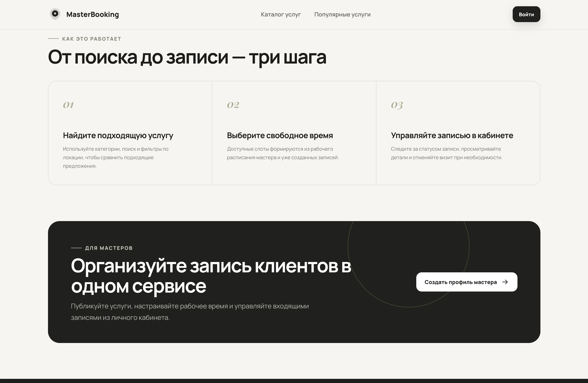

</details>

<details>
<summary><strong>👤 Регистрация и вход</strong></summary>

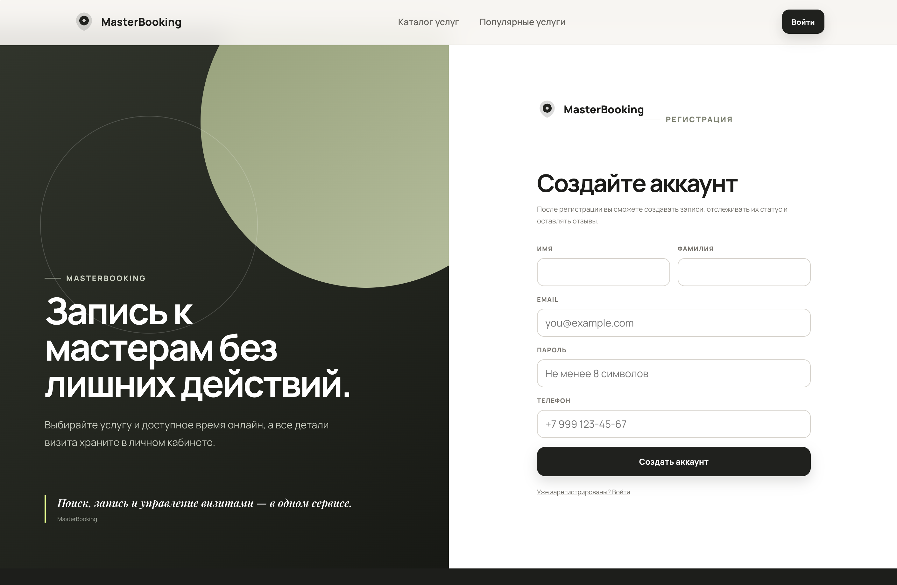

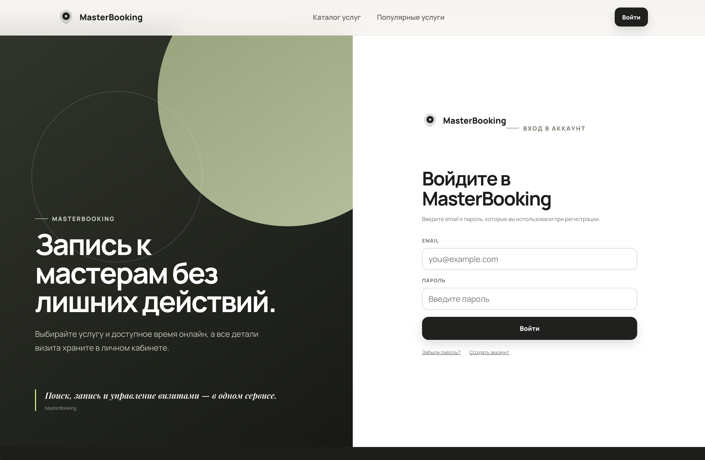

</details>

<details>
<summary><strong>🔐 Восстановление пароля</strong></summary>


</details>

<details>
<summary><strong>💇 Страница мастера</strong></summary>


</details>

<details>
<summary><strong>💈 Услуги</strong></summary>


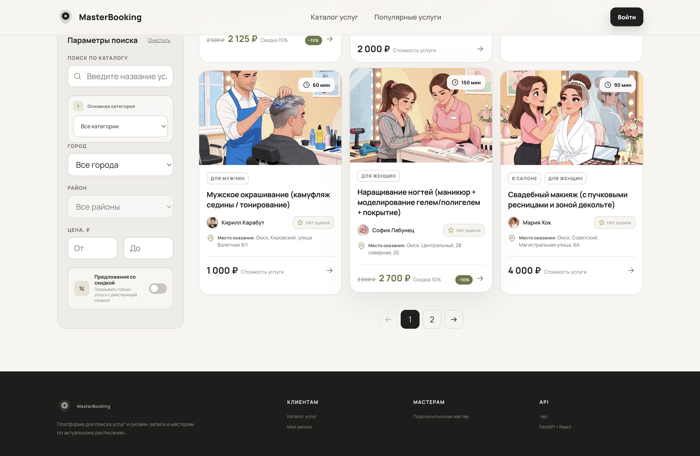


</details>

<details>
<summary><strong>➕ Создание услуги</strong></summary>


</details>

<details>
<summary><strong>📅 Создание расписания</strong></summary>


</details>

<details>
<summary><strong>📋 Запись на услугу</strong></summary>


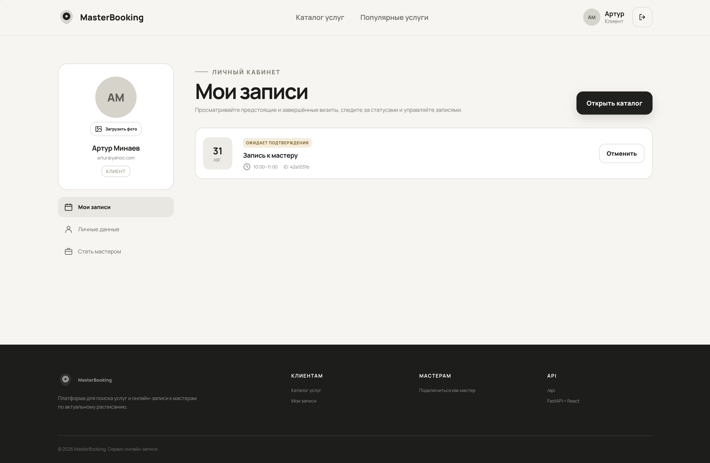

</details>

<details>
<summary><strong>✅ Подтверждение записи</strong></summary>


</details>

<details>
<summary><strong>❌ Отмена записи</strong></summary>


</details>

<details>
<summary><strong>👥 Записи клиентов мастера</strong></summary>


</details>

<details>
<summary><strong>⭐ Отзывы</strong></summary>

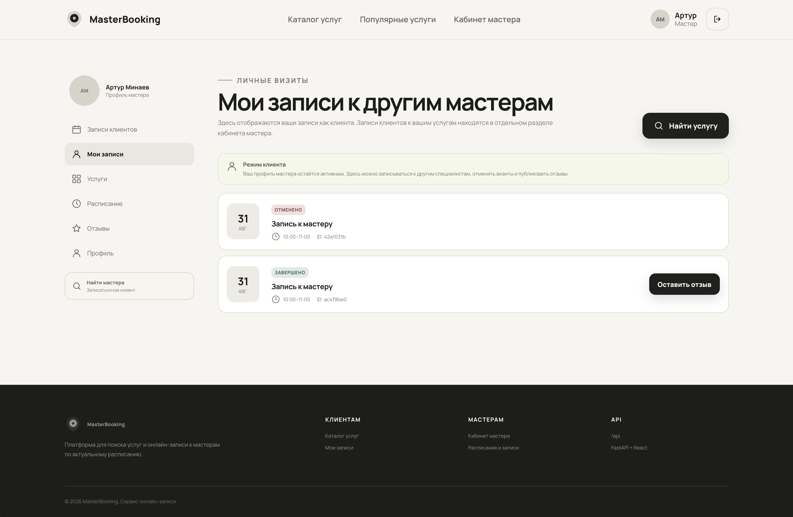

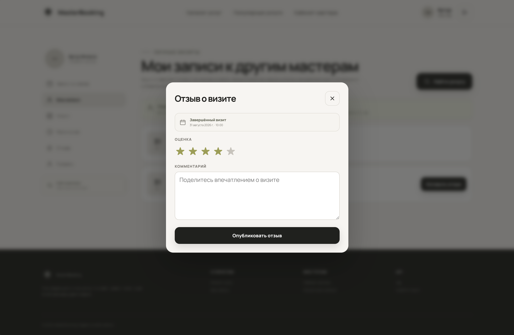


</details>

<details>
<summary><strong>🔎 Фильтрация</strong></summary>

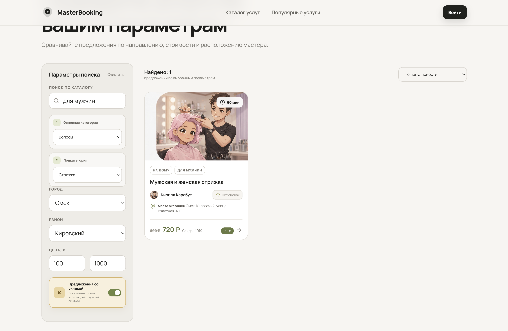

</details>

<details>
<summary><strong>👤 Страница клиента</strong></summary>


</details>

<details>
<summary><strong>🛠️ Административная часть</strong></summary>

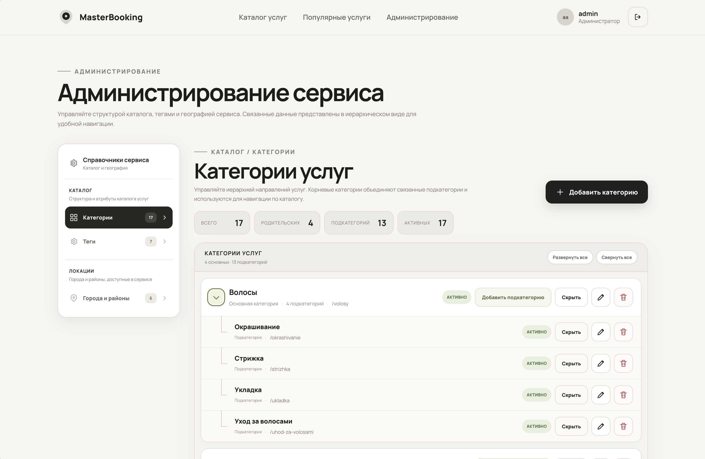

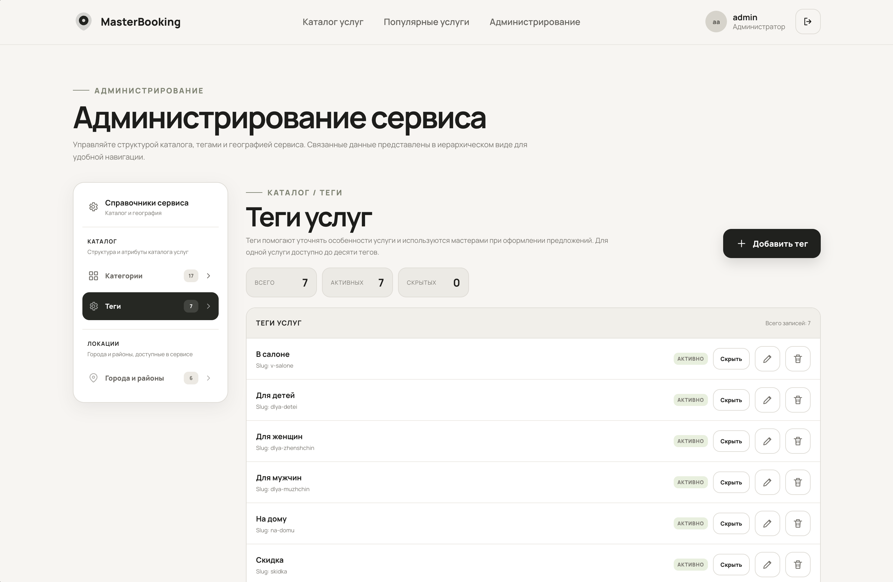

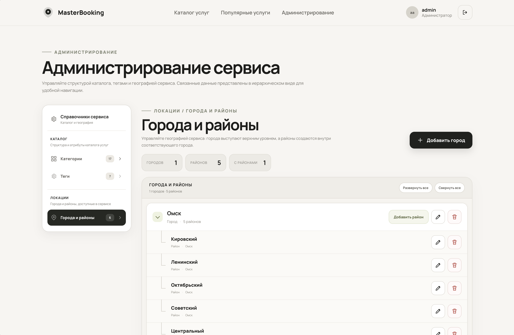

</details>

<details>
<summary><strong>🏷️ Управление тегами</strong></summary>


</details>

<details>
<summary><strong>🗂️ Управление категориями</strong></summary>


</details>

<details>
<summary><strong>📍 Города и районы</strong></summary>


</details>

---

## 🛠️ Технологический стек

| Технология          | Назначение                            |
| ------------------- | ------------------------------------- |
| **Python 3.12+**    | Основной язык backend                 |
| **FastAPI**         | REST API                              |
| **Pydantic**        | Валидация данных и схемы API          |
| **SQLAlchemy 2.0**  | ORM и работа с PostgreSQL             |
| **asyncpg**         | Асинхронный PostgreSQL driver         |
| **Alembic**         | Миграции базы данных                  |
| **PostgreSQL 17**   | Основная база данных                  |
| **Redis**           | Кэш, временные данные и брокер Celery |
| **Celery**          | Фоновые и периодические задачи        |
| **pwdlib + Argon2** | Безопасное хеширование паролей        |
| **PyJWT**           | JWT-аутентификация                    |
| **Pillow**          | Работа с изображениями                |
| **React 18**        | Frontend                              |
| **Vite 6**          | Frontend build tool                   |
| **Nginx**           | Web server и reverse proxy            |
| **Docker Compose**  | Контейнеризация                       |
| **pytest**          | Тестирование                          |
| **httpx**           | Тестирование HTTP API                 |
| **Ruff**            | Линтинг и форматирование              |
| **uv**              | Управление Python-зависимостями       |

---

## ⚙️ Установка и запуск

### 1. Клонирование репозитория

```bash
git clone https://github.com/GitForgeK-1308/MasterBooking.git
cd MasterBooking
```

### 2. Настройка Backend

Перейдите в backend:

```bash
cd backend
```

Создайте `.env` на основе `.env.example`:

```bash
cp .env.example .env
```

Заполните необходимые переменные окружения.

После этого установите зависимости:

```bash
uv sync
```

### 3. Запуск Backend локально

Из директории `backend`:

```bash
uv run fastapi dev src/main.py
```

API будет доступно по адресу:

```text
http://127.0.0.1:8000
```

Swagger UI:

```text
http://127.0.0.1:8000/docs
```

ReDoc:

```text
http://127.0.0.1:8000/redoc
```

---

## 🐳 Запуск через Docker Compose

Для запуска всей инфраструктуры из корня проекта:

```bash
docker compose up --build
```

Compose автоматически поднимает:

```text
PostgreSQL
Redis
Alembic migrations
FastAPI
Celery worker
Celery beat
React + Nginx
```

Frontend будет доступен через:

```text
http://localhost:3000
```

Backend API:

```text
http://localhost:8000
```

Swagger:

```text
http://localhost:8000/docs
```

Остановить контейнеры:

```bash
docker compose down
```

Остановить контейнеры и удалить volumes:

```bash
docker compose down -v
```

---

## 🔄 Полезные Docker-команды

Проверить состояние контейнеров:

```bash
docker compose ps
```

Посмотреть логи backend:

```bash
docker compose logs backend
```

Посмотреть логи Celery:

```bash
docker compose logs celery_worker
```

Посмотреть логи Redis:

```bash
docker compose logs redis
```

Открыть shell внутри backend:

```bash
docker compose exec backend bash
```

Проверить зарегистрированные Celery-задачи:

```bash
docker compose exec celery_worker \
  uv run celery -A src.tasks.celery_app:celery_app inspect registered
```

---

## 🧪 Запуск тестов

Все тесты:

```bash
uv run pytest
```

С подробным выводом:

```bash
uv run pytest -v
```

Проверка Ruff:

```bash
uv run ruff check .
```

Проверка форматирования:

```bash
uv run ruff format --check .
```

Автоматическое форматирование:

```bash
uv run ruff format .
```

---

## 📁 Структура проекта

```text
MasterBooking/
│
├── backend/
│   ├── src/
│   │   ├── alembic/
│   │   │   └── versions/
│   │   │
│   │   ├── auth/
│   │   ├── bookings/
│   │   ├── categories/
│   │   ├── cities/
│   │   ├── districts/
│   │   ├── masters/
│   │   ├── offerings/
│   │   ├── reviews/
│   │   ├── tags/
│   │   ├── users/
│   │   │
│   │   ├── email/
│   │   ├── redis/
│   │   ├── storage/
│   │   ├── tasks/
│   │   │
│   │   ├── dependencies/
│   │   ├── exceptions/
│   │   ├── models/
│   │   ├── repositories/
│   │   ├── schemas/
│   │   ├── services/
│   │   │
│   │   └── main.py
│   │
│   ├── tests/
│   ├── uploads/
│   ├── Dockerfile
│   ├── pyproject.toml
│   └── uv.lock
│
├── frontend/
│   ├── src/
│   ├── public/
│   ├── Dockerfile
│   ├── nginx.conf
│   ├── package.json
│   └── ...
│
├── docs/
│   └── screenshots/
│
├── compose.yaml
├── .gitignore
└── README.md
```

---

## 🔒 Конфигурация и секреты

Конфигурация приложения хранится через переменные окружения.

Секретные данные не должны находиться в исходном коде или публиковаться в Git.

В `.env` рекомендуется хранить:

* `DATABASE_URL`;
* `REDIS_URL`;
* `CELERY_BROKER_URL`;
* JWT configuration;
* email configuration;
* секретные ключи приложения.

Файл `.env` должен быть добавлен в `.gitignore`.

Для публичного репозитория следует использовать `.env.example` без реальных секретов.

---

## 🗺️ Roadmap

Проект продолжает развиваться.

Планируемые улучшения:

* [ ] Добавить дополнительные уведомления
* [ ] Улучшить поиск и фильтрацию мастеров
* [ ] Добавить дополнительные возможности профиля мастера
* [ ] Улучшить production-конфигурацию
* [ ] Подготовить production deployment

---

## 📌 Статус проекта

**MasterBooking находится в активной разработке.**

На текущем этапе реализованы основные пользовательские сценарии:

* регистрация и авторизация;
* JWT-аутентификация;
* восстановление пароля;
* роли `CLIENT`, `MASTER`, `ADMIN`;
* профили пользователей;
* мастера;
* услуги;
* категории;
* теги;
* города и районы;
* расписание мастеров;
* бронирование;
* отмена и подтверждение записей;
* управление клиентскими записями;
* отзывы;
* фотографии услуг;
* Redis;
* Celery;
* PostgreSQL;
* Alembic;
* Docker Compose;
* React frontend;
* Nginx;
* автоматические тесты.

---

## 👨‍💻 Автор

**GitForgeK-1308**

[GitHub](https://github.com/GitForgeK-1308?utm_source=chatgpt.com)

---

## 📄 Лицензия

Лицензия проекта будет добавлена отдельно.
